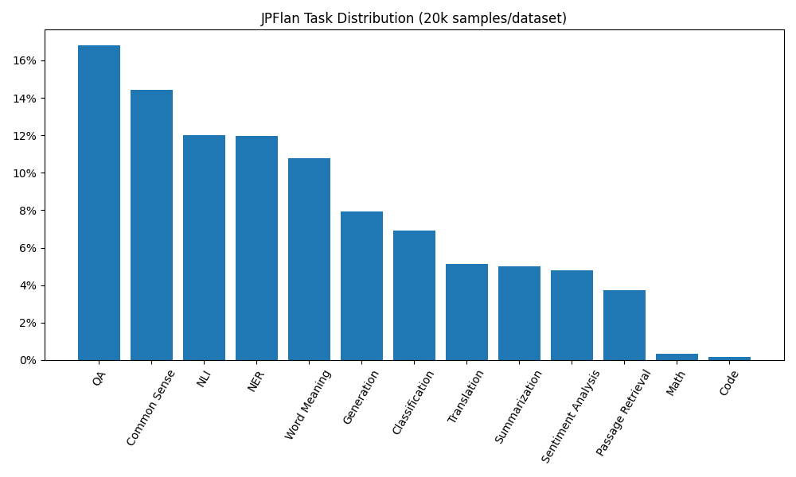

# JPFlan

[日本語READMEはこちら](README_jp.md)

This repository contains the code to create instruction tuning datasets using the raw data of [jpflan-raw](https://huggingface.co/datasets/Ego/jpflan-raw).  
In the original [Flan paper](https://arxiv.org/abs/2301.13688), over 1800 downstream task datasets were collected with a focus on English, and for each one of them 10 different templates were prepared.  
JPFlan mimics Flan for Japanese language, as we collect 38 different high quality open source Japanese downstream task datasets, and provide 3 templates for each, with an additional one for few-shot examples.  

The information about each dataset, its license, size and contents are found in `dataset_info.csv`

### Usage

First copy the repository and install the dependencies:

```
git clone https://github.com/Egojr/jpflan.git
cd jpflan/
pip install -r requirements.txt
```

To create the dataset run:

```
python generate_dataset.py
```

The number of samples for each dataset, few-shot shots and their maximum length are customizable, as are the templates found in `templates.csv`.   
With the above command the resulting dataset will be saved in the `./jpflan` folder.  
You can load it using the `datasets.load_from_disk` function later, by specifying the correct path.

### Default Settings Task Distribution

Or you can use the dataset obtained using the default settings and loaded on huggingface: [jpflan](https://huggingface.co/datasets/Ego/jpflan).

The default settings sample `min(10000, dataset_size)` for both 0-shot and few-shot. That means that the dataset will have at most 20000 samples for each dataset.  
Moreover, there are no overlappping questions among 0-shot and few-shot questions, respectively. For few-shot we also make sure that the main question does not appear as a shot example. 

The dataset obtained using the default settings presents this task distribution:  


